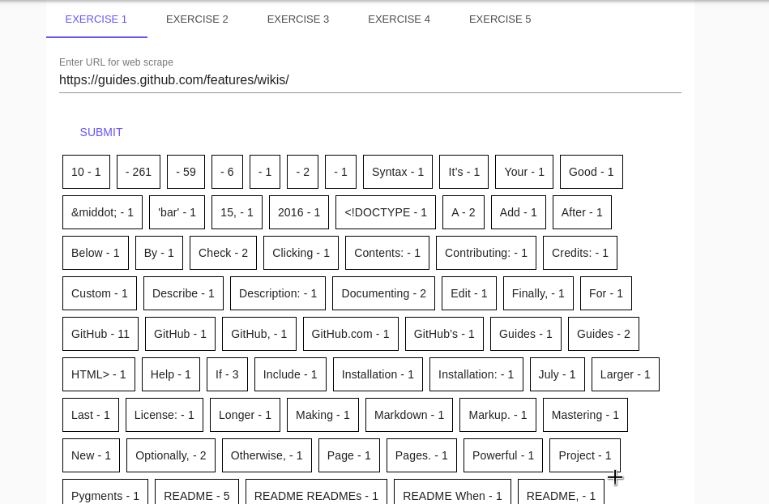
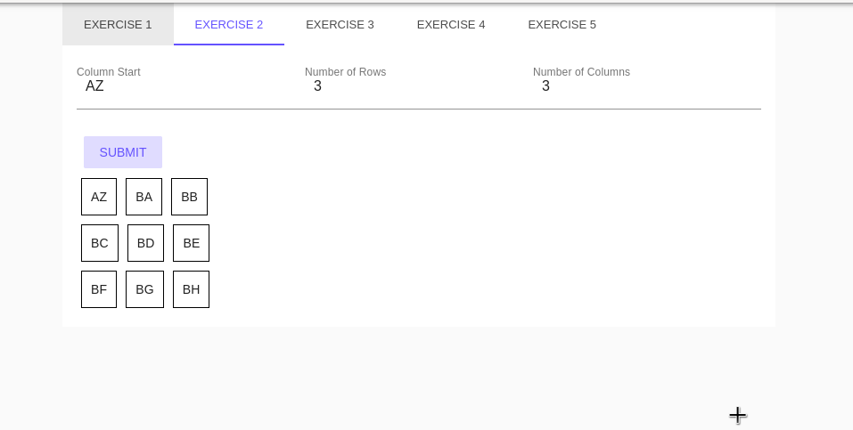
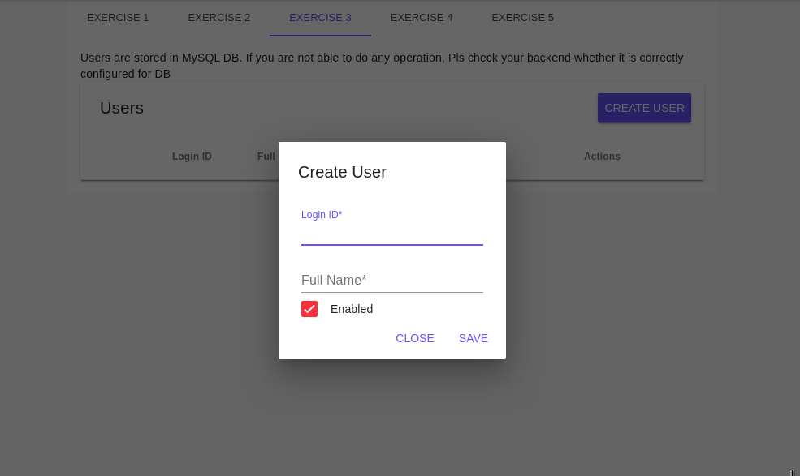
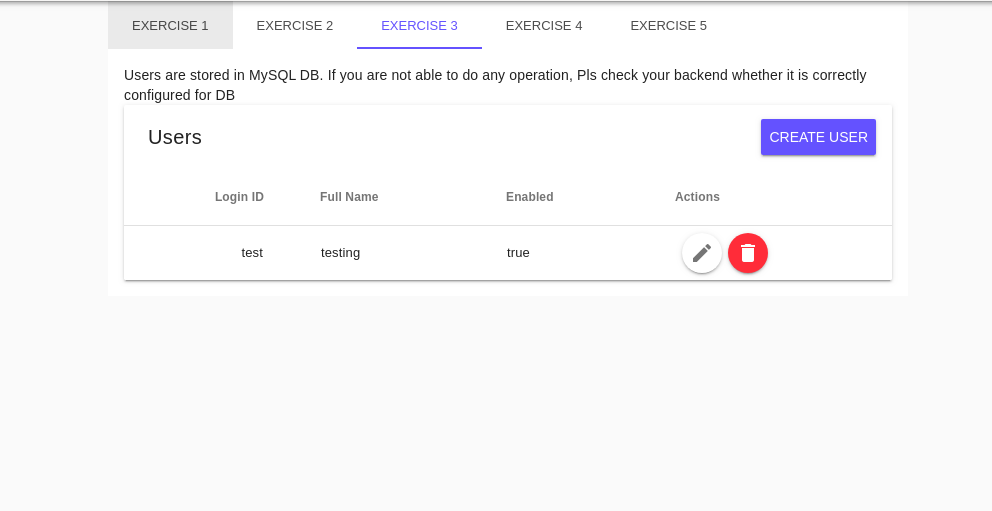
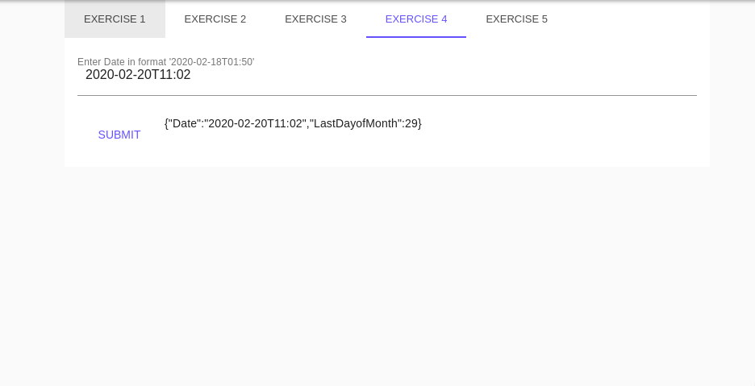
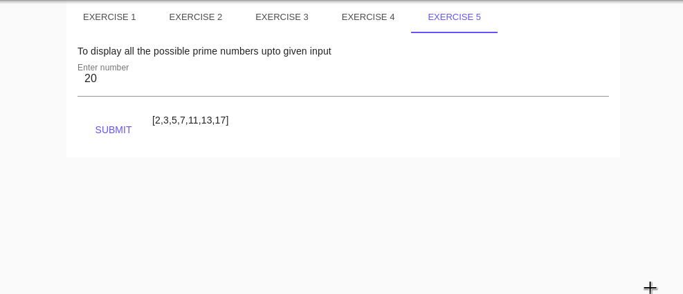

# go-utility

## Pre-requisites

1. This application require MySql database to connect with.

    Change the DB details in <code>openDB() (*sql.DB, error)</code>  in  <a href="https://github.com/anil-appface/go-utility/blob/6377949be3244b76dbcd4afd282ffd91fdf8d62b/app.go#L40">app.go</a> file

# Run

Use  <code>go run .</code> to start the server

To Install front-end app, please go through this link <a href="frontend-ui/README.md">Frontend-UI Readme</a>

# Screenshots

1. Exercise 1

2. Exercise 2

3. Exercise 3

4. Exercise 4

5. Exercise 5

# Good to have

1. Error handling in rest handlers.
2. Having more logs. 
3. To cover more unit test cases.
